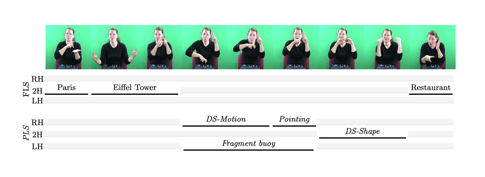

# CSLR - LIMSI



This is our implementation of the training and testing code for the paper [Dicta-Sign-LSF-v2: Remake of a Continuous LSF Dialogue Corpus and a First Baseline for Automatic SLP, LREC, 2020](https://). It has been tested with two corpora, DictaSign and NCSLGR (see below).

The model is a simple RNN, trained in a supervised fashion, with the following properties:
* Its input is preprocessed video data (see the paper and documentation in the LSF corpus data [Dicta-Sign-LSF-v2](https://www.ortolang.fr/market/corpora/dicta-sign-lsf-v2/) for details). The preprocessing code will be released soon.
* The model can be used to predict "sign types" (on a frame basis), or the independent recognition of different SL structures. See the documentation in the different files (more complete documentation to come).


## Requirements
The training and testing scripts require:
* Keras on top of Tensorflow (1.X or 2.X)

## Usage
See tutorial: [Main tutorial](notebooks/Main_tutorial.ipynb)

## Dataset
The original data:
* [Dicta-Sign-LSF-v2](https://www.ortolang.fr/market/corpora/dicta-sign-lsf-v2/) (video + annotation (csv format) + features generated by [this](https://github.com/vbelissen/cslr_limsi_features/))
  * Annotations found in ortolang should be converted to a .npz file using `ortolang_to_framewise_annotation.py` before running the scripts for the first time
  * .npy feature files found in ortolang should be placed in data/processed/DictaSign/
* [NCSLGR](https://www.bu.edu/asllrp/ncslgr.html) (video + annotation)

Data in old format (simply uncompress the zip in cslr_limsi/), should not be used if you can access features in ortolang:
* https://drive.google.com/file/d/1byTR9zx8FSwC5CjBRf498l84z5DnxHz4/view?usp=sharing


## Citation
If you find the project helpful, please cite:
```
@InProceedings{Belissen.etal.2020,
  author    = {Belissen, Valentin and Gouiffès, Michèle and Braffort, Annelies},
  title     = {{Dicta-Sign-LSF-v2: Remake of a Continuous French Sign Language Dialogue Corpus and a First Baseline for Automatic Sign Language Processing}},
  booktitle = {LREC},
  year      = {2020},
}
```
